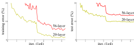
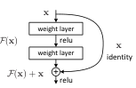
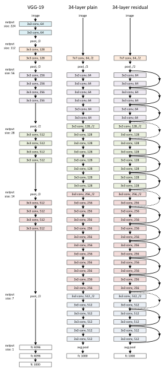
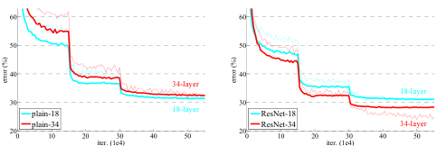
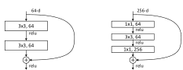
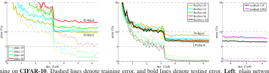
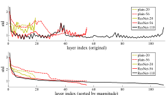

GvF

This CVPR paper is the Open Access version, provided by the Computer Vision Foundation. Except for this watermark, it is identical to the version available on IEEE Xplore.

# Deep Residual Learning for Image Recognition

Kaiming He

Xiangyu Zhan

Shaoqing Ren

Microsoft Research

$\{kahe, v-xiangz, v-shren, jiansun\}@microsoft.com$

## Abstract

Deeper neural networks are more difficult to train. We present a residual learning framework to ease the training of networks that are substantially deeper than those used previously. We explicitly reformulate the layers as learning residual functions with reference to the layer inputs, instead of learning unprecedented junctions. We provide comprehensive empirical evidence showing that these residual networks are easier to optimize, and can gain accuracy from considerably increased depth. On the ImageNet dataset we evaluate $8\times$ residual nets with a depth of up to 152 layers— $8\times$ deeper than VGG nets [40] but still having lower complexity. An ensemble of these residual nets achieves 3.57 % error on the ImageNet test set. This result won the 1st place on the ILSVRC 2015 classification task. We also present analysis on CIFAR-10 with 100 and 1000 layers.

The depth of representations is of central importance for many visual recognition tasks. Solely due to our extremely deep representations, we obtain a 28 % relative improvement on the COCO object detection dataset. Deep residual nets are foundations of our submissions to ILSVRC & COCO 2015 competitions $^1$ , where we also won the 1st places on the tasks of ImageNet detection, ImageNet localization, COCO detection, and COCO segmentation.

## 1. Introduction

Deep convolutional neural networks [22, 21] have led to a series of breakthroughs for image classification [21, 49, 39] . Deep networks naturally integrate low/mid/highlevel features [49] and classifiers in an end-to-end multilayer fashion, and the “ levels" of features can be enriched by the number of stacked layers (depth). Recent evidence [40, 43] reveals that network depth is of crucial importance, and the leading results [40, 43, 12, 16] on the challenging ImageNet dataset [35] all exploit "very deep" [40] models, with a depth of sixteen [40] to thirty [16] . Many other nontrivial visual recognition tasks [7, 11, 6, 32, 27] have also

greatly benefited from very deep models.

Figure 1. Training error (left) and test error (right) on CIFAR-10 with 20-layer and 56-layer "plain" networks. The deeper network has higher training error, and thus test error. Similar phenomena on ImageNet is presented in Fig. 4 .

Driven by the significance of depth, a question arises: Is learning better networks as easy as stacking more layers? An obstacle to answering this question was the notorious problem of vanishing/exploding gradients [14, 1, 8] , which hamper convergence from the beginning. This problem, however, has been largely addressed by normalized initialization [23, 8, 36, 12] and intermediate normalization layers [16] , which enable networks with tens of layers to start converging for stochastic gradient descent (SGD) with backpropagation [22] .

When deeper networks are able to start converging, a degradation problem has been exposed: with the network depth increasing, accuracy gets saturated (which might be unsurprising) and then degrades rapidly. Unexpectedly, such degradation is not caused by overfitting , and adding more layers to a suitably deep model leads to higher training error , as reported in [10, 41] and thoroughly verified by our experiments. Fig. 1 shows a typical example.

The degradation (of training accuracy) indicates that no all systems are similarly easy to optimize. Let us consider a shallower architecture and its deeper counterpart that adds more layers onto it. There exists a solution by construction to the deeper model: the added layers are identity mapping, and the other layers are copied from the learned shallower model. The existence of this constructed solution indicates that a deeper model should produce no higher training error than its shallower counterpart. But experiments show that our current solvers on hand are unable to find solutions that

1http://image-net.org/challenges/LSVRC/2015/ and http://mscoco.org/dataset/#detections-challenge2015.

4/0

---

Figure 2. Residual learning: a building block.

are comparably good or better than the constructed solution (or unable to do so in feasible time).

In this paper, we address the degradation problem by introducing a deep residual learning framework. Instead of hoping each few stacked layers directly fit a desired underlying mapping, we explicitly let these layers fit a residual mapping. Formally, denoting the desired underlying mapping as $\mathcal{H}(\mathbf{x})$ , we let the stacked nonlinear layers fit another mapping of $\mathcal{F}(\mathbf{x}):=\mathcal{H}(\mathbf{x})-\mathbf{x}$ . The original mapping is recast into $\mathcal{F}(\mathbf{x})+\mathbf{x}$ . We hypothesize that it is easier to optimize the residual mapping than to optimize the original, unreferenced mapping. To the extreme, if an identity mapping were optimal, it would be easier to push the residual to zero than to fit an identity mapping by a stack of nonlinear layers.

The formulation of $\mathcal{F}(\mathbf{x})+\mathbf{x}$ can be realized by feedforward neural networks with “ shortcut connections" (Fig. 2 ). Shortcut connections [2, 33, 48] are those skipping one or more layers. In our case, the shortcut connections simply perform identity mapping, and their outputs are added to the outputs of the stacked layers (Fig. 2 ). Identity shortcut connections add neither extra parameter nor computational complexity. The entire network can still be trained end-to-end by SGD with backpropagation, and can be easily implemented using common libraries ( e.g. , Caffe [19] ) without modifying the solvers.

We present comprehensive experiments on ImageNet [35] to show the degradation problem and evaluate our method. We show that: 1) Our extremely deep residual nets are easy to optimize, but the counterpart “ plain" nets (that simply stack layers) exhibit higher training error when the depth increases; 2) Our deep residual nets can easily enjoy accuracy gains from greatly increased depth, producing results substantially better than previous networks.

Similar phenomena are also shown on the CIFAR-10 set [20] , suggesting that the optimization difficulties and the effects of our method are not just akin to a particular dataset. We present successfully trained models on this dataset with over 100 layers, and explore models with over 1000 layers.

On the ImageNet classification dataset [35] , we obtain excellent results by extremely deep residual nets. Our 152layer residual net is the deepest network ever presented on ImageNet, while still having lower complexity than VGG nets [40] . Our ensemble has 3.57% top-5 error on the

ImageNet test set, and won the 1st place in the ILSVRC 2015 classification competition . The extremely deep representations also have excellent generalization performance on other recognition tasks, and lead us to further win the 1st places on: ImageNet detection , ImageNet localization , COCO detection , and COCO segmentation in ILSVRC & COCO 2015 competitions. This strong evidence shows that the residual learning principle is generic, and we expect that it is applicable in other vision and non-vision problems.

## 2. Related Work

Residual Representations. In image recognition, VLAD [18] is a representation that encodes by the residual vectors with respect to a dictionary, and Fisher Vector [30] can be formulated as a probabilistic version [18] of VLAD. Both of them are powerful shallow representations for image retrieval and classification [4, 47] . For vector quantization, encoding residual vectors [17] is shown to be more effective than encoding original vectors.

In low-level vision and computer graphics, for solving Partial Differential Equations (PDEs), the widely used Multigrid method [3] reformulates the system as subproblems at multiple scales, where each subproblem is responsible for the residual solution between a coarser and a finer scale. An alternative to Multigrid is hierarchical basis preconditioning [44, 45] , which relies on variables that represent residual vectors between two scales. It has been shown [3, 44, 45] that these solvers converge much faster than standard solvers that are unaware of the residual nature of the solutions. These methods suggest that a good reformulation or preconditioning can simplify the optimization.

Shortcut Connections . Practices and theories that lead to shortcut connections [2, 33, 48] have been studied for a long time. An early practice of training multi-layer perceptrons (MLPs) is to add a linear layer connected from the network input to the output [33, 48] . In [43, 24] , a few intermediate layers are directly connected to auxiliary classifiers for addressing vanishing/exploding gradients. The papers of [38, 37, 31, 46] propose methods for centering layer responses, gradients, and propagated errors, implemented by shortcut connections. In [43] , an “ inception" layer is composed of a shortcut branch and a few deeper branches.

Concurrent with our work, “ highway networks" [41, 42] present shortcut connections with gating functions [15] . These gates are data-dependent and have parameters, in contrast to our identity shortcuts that are parameter-free. When a gated shortcut is “ closed" (approaching zero), the layers in highway networks represent non-residual functions. On the contrary, our formulation always learns residual functions; our identity shortcuts are never closed, and all information is always passed through, with additional residual functions to be learned. In addition, high-

102

---

way networks have not demonstrated accuracy gains with extremely increased depth (e,g., over 100 layers).

## 3. Deep Residual Learnin

### 3.1. Residual Learning

Let us consider $\mathcal{H}(\mathbf{x})$ as an underlying mapping to be fit by a few stacked layers (not necessarily the entire net), with $\mathbf{x}$ denoting the inputs to the first of these layers. If one hypothesizes that multiple nonlinear layers can asymptotically approximate complicated functions 2 , then it is equivalent to hypothesize that they can asymptotically approximate the residual functions, i.e. , $\mathcal{H}(\mathbf{x}) - \mathbf{x}$ (assuming that the input and output are of the same dimensions). So rather than expect stacked layers to approximate $\mathcal{H}(\mathbf{x})$ , we explicitly let these layers approximate a residual function $\mathcal{F}(\mathbf{x}):=\mathcal{H}(\mathbf{x})-\mathbf{x}$ . The original function thus becomes $\mathcal{F}(\mathbf{x})+\mathbf{x}$ . Although both forms should be able to asymptotically approximate the desired functions (as hypothesized), the case of learning might be different.

This reformulation is motivated by the counterintuitive phenomena about the degradation problem (Fig. 1 , left). As we discussed in the introduction, if the added layers can be constructed as identity mappings, a deeper model should have training error no greater than its shallower counterpart. The degradation problem suggests that the solvers might have difficulties in approximating identity mappings by multiple nonlinear layers. With the residual learning reformulation, if identity mappings are optimal, the solvers may simply drive the weights of the multiple nonlinear layers toward zero to approach identity mappings.

In real cases, it is unlikely that identity mappings are optimal, but our reformulation may help to precondition the problem. If the optimal function is closer to an identity mapping than to a zero mapping, it should be easier for the solver to find the perturbations with reference to an identity mapping, than to learn the function as a new one. We show by experiments (Fig. 7 ) that the learned residual functions in general have small responses, suggesting that identity mappings provide reasonable preconditioning.

### 3.2. Identity Mapping by Shortcuts

$We adopt residual learning to every few stacked layers. \\ A building block is shown in Fig. 2 . Formally, in this paper \\ we consider a building block defined as: \\ $$ \\     \mathbf{y}=\mathcal{F}(\mathbf{x},\left\{W_i\right\})+\mathbf{x}. \\ \eqno(1) \\ $$$

Here $\mathbf{x}$ and $\mathbf{y}$ are the input and output vectors of the layers considered. The function $\mathcal{F}(\mathbf{x},\{W_i\})$ represents the residual mapping to be learned. For the example in Fig. 2 that has two layers, $\mathcal{F}=W_2\sigma(W_1\mathbf{x})$ in which $\sigma$ denotes

ReLU [29] and the biases are omitted for simplifying notations. The operation $\mathcal{F}+\mathbf{x}$ is performed by a shortcut connection and element-wise addition. We adopt the second nonlinearity after the addition ( i.e., $\sigma(\mathbf{y})$ , see Fig. 2 ).

The shortcut connections in Eqn.( 1 ) introduce neither extra parameter nor computation complexity. This is not only attractive in practice but also important in our comparisons between plain and residual networks. We can fairly compare plain/residual networks that simultaneously have the same number of parameters, depth, width, and computational cost (except for the negligible element-wise addition).

The dimensions of $\mathbf{x}$ and $\mathcal{F}$ must be equal in Eqn.( 1 ). If this is not the case ( e.g. , when changing the input/output channels), we can perform a linear projection $W_s$ by the shortcut connections to match the dimensions: $$\mathbf{y}=\mathcal{F}(\mathbf{x},\left\{W_i\right\})+W_s\mathbf{x}.\eqno(2)$$

We can also use a square matrix $W_s$ in Eqn.(1). But we will show by experiments that the identity mapping is sufficient for addressing the degradation problem and is economical, and thus $W_s$ is only used when matching dimensions.

The form of the residual function $\mathcal{F}$ is flexible. Experiments in this paper involve a function $\mathcal{F}$ that has two or three layers (Fig. 5 ), while more layers are possible. But if $\mathcal{F}$ has only a single layer, Eqn.( 1 ) is similar to a linear layer: $\boldsymbol{y}=W_1\mathbf{x}+\mathbf{x}$ , for which we have not observed advantages.

We also note that although the above notations are about fully-connected layers for simplicity, they are applicable to convolutional layers. The function $\mathcal{F}(\mathbf{x}_t, \left(W_i\right))$ can represent multiple convolutional layers. The element-wise addition is performed on two feature maps, channel by channel,

### 3.3. Network Architectures

We have tested various plain/residual nets, and have observed consistent phenomena. To provide instances for discussion, we describe two models for ImageNet as follows.

Plain Network. Our plain baselines (Fig. 3 , middle) are mainly inspired by the philosophy of VGG nets [40] (Fig. 3 , left). The convolutional layers mostly have $3\times3$ filters and follow two simple design rules: (i) for the same output feature map size, the layers have the same number of filters; and (ii) if the feature map size is halved, the number of filters is doubled so as to preserve the time complexity per layer. We perform downsampling directly by convolutional layers that have a stride of 2. The network ends with a global average pooling layer and a 1000-way fully-connected layer with softmax. The total number of weighted layers is 34 in Fig. 3 (middle).

It is worth noticing that our model has fewer filters and lower complexity than VGG nets [40] (Fig. 3 , left). Our 34layer baseline has 3.6 billion FLOPs (multiply-adds), which is only 18 % of VGG-19 (19.6 billion FLOPs).

$^{2}$ This hypothesis, however, is still an open question. See [28] .

723

---

Figure 3. Example network architectures for ImageNet. Left : the VGG-19 model [40] (19.6 billion FLOPs) as a reference. Middle : a plain network with 34 parameter layers (3.6 billion FLOPs). Right : a residual network with 34 parameter layers (3.6 billion FLOPs). The dotted shortcuts increase dimensions. Table I shows more details and other variants.

Residual Network. Based on the above plain network, we insert shortcut connections (Fig. 3 , right) which turn the network into its counterpart residual version. The identity shortcuts (Eqn.(1)) can be directly used when the input and output are of the same dimensions (solid line shortcuts in Fig. 3 ). When the dimensions increase (dotted line shortcuts in Fig. 3 ), we consider two options: (A) The shortcut still performs identity mapping, with extra zero entries padded for increasing dimensions. This option introduces no extra parameter; (B) The projection shortcut in Eqn.(2) is used to match dimensions (done by $1\times1$ convolutions). For both options, when the shortcuts go across feature maps of two sizes, they are performed with a stride of 2.

### 3.4. Implementation

Our implementation for ImageNet follows the practice in [21, 40] . The image is resized with its shorter side randomly sampled in $\left[256,480\right]$ for scale augmentation [40] . A 224 $\times$ 224 crop is randomly sampled from an image or its horizontal flip, with the per-pixel mean subtracted [21] . The standard color augmentation in [21] is used. We adopt batch normalization (BN) [16] right after each convolution and before activation, following [16] . We initialize the weights as in [12] and train all plain/residual nets from scratch. We use SGD with a mini-batch size of 256. The learning rate starts from 0.1 and is divided by 10 when the error plateaus, and the models are trained for up to $60\times10^{4}$ iterations. We use a weight decay of 0.0001 and a momentum of 0.9. We do not use dropout [13] , following the practice in [16] .

In testing, for comparison studies we adopt the standard 10-crop testing [21] . For best results, we adopt the fullyconvolutional form as in [40, 12] , and average the scores at multiple scales (images are resized such that the shorter side is in $\{224, 256, 384, 480, 640\}$ ).

## 4. Experiments

### 4.1. ImageNet Classification

We evaluate our method on the ImageNet 2012 classification dataset [35] that consists of 1000 classes. The models are trained on the 1.28 million training images, and evaluated on the 50k validation images. We also obtain a final result on the 100k test images, reported by the test server. We evaluate both top-1 and top-5 error rates.

Plain Networks. We first evaluate 18-layer and 34-layer plain nets. The 34-layer plain net is in Fig. 3 (middle). The 18-layer plain net is of a similar form. See Table 1 for detailed architectures.

The results in Table 2 show that the deeper 34-layer plain net has higher validation error than the shallower 18-layer plain net. To reveal the reasons, in Fig. 4 (left) we compare their training/validation errors during the training procedure. We have observed the degradation problem - the

1/23

---

<table><tr><td rowspan="2">layer name conv1</td><td rowspan="2">output size  112 × 112</td><td colspan="3">18-layer</td><td colspan="3">50-layer</td><td colspan="3">101-layer</td><td colspan="3">152-layer</td></tr><tr><td></td><td></td><td></td><td></td><td>7 v7, 64, stride 2</td><td></td><td></td><td></td><td></td><td></td><td></td><td></td></tr><tr><td>conv2_x</td><td>56×56</td><td>[3 x3, 64][3 x3, 64]</td><td>×2</td><td>[3 x3, 64][3 x3, 64]</td><td>×3</td><td>[3 x3, 64][3 x3, 156]</td><td>×3</td><td>[3 x3, 64][3 x3, 156]</td><td>×3</td><td>[3 x3, 64][3 x3, 156]</td><td>×3</td><td>[3 x3, 64][3 x3, 156]</td><td>×3</td></tr><tr><td>conv3_x</td><td>28×28</td><td>[3 x3, 128][3 x3, 128]</td><td>×2</td><td>[3 x3, 128][3 x3, 128]</td><td>×4</td><td>[3 x3, 128][3 x3, 128]</td><td>×4</td><td>[3 x3, 128][3 x3, 152]</td><td>×4</td><td>[3 x3, 128][3 x3, 152]</td><td>×4</td><td>[3 x3, 128][3 x3, 152]</td><td>×8</td></tr><tr><td>conv4_x</td><td>14 ×14</td><td>[3 x3, 296][3 x3, 296</td><td>×2</td><td>[3 x3, 296][3 x3, 296]</td><td>×6</td><td>[3 x3, 296][3 x3, 128]</td><td>×6</td><td>[3 x3, 296][3 x3, 128]</td><td>×6</td><td>[3 x3, 296][3 x3, 128]</td><td>×23</td><td>[3 x3, 296][3 x3, 1024]</td><td>×36</td></tr><tr><td>conv5_x</td><td>7 ×7</td><td>[3 x3, 512][3 x3, 512]</td><td>×2</td><td>[3 x3, 512][3 x3, 512]</td><td>×3</td><td>[3 x3, 512][3 x3, 512]</td><td>×3</td><td>[3 x3, 512][3 x3, 128]</td><td>×3</td><td>[3 x3, 512][3 x3, 2048</td><td>×3</td><td>[3 x3, 512][3 x3, 1048]</td><td>×3</td></tr><tr><td></td><td>1 × 1</td><td></td><td></td><td></td><td></td><td colspan="9">average pool, 1000-d fe, softmax</td></tr><tr><td colspan="2">FLOPs</td><td colspan="3">1.8 × 10 5</td><td colspan="3">3.6 × 10 6</td><td colspan="3">7.6 × 10 6</td><td colspan="3">11.3 × 10 6</td></tr></table>

Table 1. Architectures for ImageNet. Building blocks are shown in brackets (see also Fig. 5), with the numbers of blocks stacked. Downsampling is performed by conv3 _ 1, conv4 _ 1, and conv5 _ 1 with a stride of 2.

Figure 4. Training on ImageNet. Thin curves denote training error, and bold curves denote validation error of the center crops. Left: plain networks of 18 and 34 layers. Right: ResNets of 18 and 34 layers. In this plot, the residual networks have no extra parameter compared to their plain counterparts.

<table><tr><td></td><td>plain</td><td>ResNet</td></tr><tr><td>18 layers</td><td>27.94</td><td>27.88</td></tr><tr><td>34 layers</td><td>28.54</td><td>25.03</td></tr></table>

Table 2. Top-1 error ( % , 10-crop testing) on ImageNet validation. Here the ResNets have no extra parameter compared to their plain counterparts. Fig. 4 shows the training procedures.

34-layer plain net has higher training error throughout the whole training procedure, even though the solution space of the 18-layer plain network is a subspace of that of the 34-layer one.

We argue that this optimization difficulty is unlikely to be caused by vanishing gradients. These plain networks are trained with BN [16] , which ensures forward propagated signals to have non-zero variances. We also verify that the backward propagated gradients exhibit healthy norms with BN. So neither forward nor backward signals vanish. In fact, the 34-layer plain net is still able to achieve competitive accuracy (Table 3 ), suggesting that the solver works to some extent. We conjecture that the deep plain nets may have exponentially low convergence rates, which impact the

reducing of the training error ${ }^{3}$. The reason for such optimization difficulties will be studied in the future.

Next Networks. Next we evaluate 18-layer and 34layer residual nets ( ResNets ). The baseline architectures are the same as the above plain nets, expect that a shortcut connection is added to each pair of 3 $\times$ 3 filters as in Fig. 3 (right). In the first comparison (Table 2 and Fig. 4 right), we use identity mapping for all shortcuts and zero-padding for increasing dimensions (option A). So they have no extra parameter compared to the plain counterparts.

We have three major observations from Table 2 and Fig. 4 . First, the situation is reversed with residual learning – the 34-layer ResNet is better than the 18-layer ResNet (by $2.8\%$ ). More importantly, the 34-layer ResNet exhibits considerably lower training error and is generalizable to the validation data. This indicates that the degradation problem is well addressed in this setting and we manage to obtain accuracy gains from increased depth.

Second, compared to its plain counterpart, the 34-layer

${ }^{3}$ We have experimented with more training iterations $(3 \times)$ and still observed the degradation problem, suggesting that this problem cannot be feasibly addressed by simply using more iterations.

074

---

<table><tr><td>model</td><td>top-1 err.</td><td>top-5 err.</td></tr><tr><td>VGG-16 [40]</td><td>28.07</td><td>9.33</td></tr><tr><td>GoogLeNet [43]</td><td>-</td><td>9.15</td></tr><tr><td>PReLU-net [12]</td><td>24.27</td><td>7.38</td></tr><tr><td>plain-34</td><td>28.54</td><td>10.02</td></tr><tr><td>ResNet-34 A</td><td>25.03</td><td>7.76</td></tr><tr><td>ResNet-34 B</td><td>24.52</td><td>7.46</td></tr><tr><td>ResNet-34 C</td><td>24.19</td><td>7.40</td></tr><tr><td>ResNet-50</td><td>22.85</td><td>6.71</td></tr><tr><td>ResNet-101</td><td>21.75</td><td>6.05</td></tr><tr><td>ResNet-152</td><td>21.43</td><td>5.71</td></tr></table>

Table 3. Error rates ( % , 10-crop testing) on ImageNet validation. VGG-16 is based on our test. ResNet-50/101/152 are of option B that only uses projections for increasing dimensions.

<table><tr><td>method</td><td>top-1 err.</td><td>top-5 err.</td></tr><tr><td>VGG [40] (ILSVRC*14)</td><td>-</td><td>8.43†</td></tr><tr><td>GoogLeNet [43] (ILSVRC*14)</td><td>-</td><td>7.89</td></tr><tr><td>VGG [40] (v5)</td><td>24.4</td><td>7.1</td></tr><tr><td>PReLU-net [12]</td><td>21.59</td><td>5.71</td></tr><tr><td>BN-inception [16]</td><td>21.99</td><td>5.81</td></tr><tr><td>ResNet-34 B</td><td>21.84</td><td>5.71</td></tr><tr><td>ResNet-34 C</td><td>21.53</td><td>5.60</td></tr><tr><td>ResNet-50</td><td>20.74</td><td>5.25</td></tr><tr><td>ResNet-101</td><td>19.87</td><td>4.60</td></tr><tr><td>ResNet-152</td><td>19.38</td><td>4.49</td></tr></table>

validation set (except ${ }^{\dagger}$ reported on the test set).

<table><tr><td>method</td><td>top-5 err. (test)</td></tr><tr><td>VGG [40] (ILSVRC’14)</td><td>7.32</td></tr><tr><td>GoogLeNet [43] (ILSVRC’14)</td><td>6.66</td></tr><tr><td>VGG [40] (v5)</td><td>6.8</td></tr><tr><td>PReLU-net [12]</td><td>4.94</td></tr><tr><td>BN-inception [16]</td><td>4.82</td></tr><tr><td>ResNet (ILSVRC’15)</td><td>3.57</td></tr></table>

Table 5. Error rates ( % ) of ensembles . The top-5 error is on the test set of ImageNet and reported by the test server.

ResNet reduces the top-1 error by 3.5 % (Table 2), resulting from the successfully reduced training error (Fig. 4 right vs. left). This comparison verifies the effectiveness of residual learning on extremely deep systems.

Last, we also note that the 18-layer plain/residual nets are comparably accurate (Table 2 ), but the 18-layer ResNet converges faster (Fig. 4 right vs. left). When the net is "not overly deep" (18 layers here), the current SGD solver is still able to find good solutions to the plain net. In this case, the ResNet eases the optimization by providing faster convergence at the early stage.

Identity vs. Projection Shortcuts. We have shown that

parameter-free, identity shortcuts help with training. Next we investigate projection shortcuts (Eqn.(2)). In Table 3 we compare three options: (A) zero-padding shortcuts are used for increasing dimensions, and all shortcuts are parameterfree (the same as Table 2 and Fig. 4 right); (B) projection shortcuts are used for increasing dimensions, and other shortcuts are identity; and (C) all shortcuts are projections.

Figure 5. A deeper residual function $\mathcal{F}$ for ImageNet. Left: a building block (on 56 $\times$ 56 feature maps) as in Fig. 3 for ResNet34. Right: a “ bottleneck" building block for ResNet-50/101/152.

Table 3 shows that all three options are considerably better than the plain counterpart. B is slightly better than A. We argue that this is because the zero-padded dimensions in A indeed have no residual learning. C is marginally better than B, and we attribute this to the extra parameters introduced by many (thirteen) projection shortcuts. But the small differences among A/B/C indicate that projection shortcuts are not essential for addressing the degradation problem. So we do not use option C in the rest of this paper, to reduce memory/time complexity and model sizes. Identity shortcuts are particularly important for not increasing the complexity of the bottleneck architectures that are introduced below.

Deeper Bottleneck Architectures. Next we describe our deeper nets for ImageNet. Because of concerns on the training time that we can afford, we modify the building block as a bottleneck design $^4$ . For each residual function $\mathcal{F}$ , we use a stack of 3 layers instead of 2 (Fig. 5 ). The three layers are 1 $\times$ 1, 3 $\times$ 3, and 1 $\times$ 1 convolutions, where the 1 $\times$ 1 layers are responsible for reducing and then increasing (restoring) dimensions, leaving the 3 $\times$ 3 layer a bottleneck with smaller input/output dimensions. Fig. 5 shows an example, where both designs have similar time complexity.

The parameter-free identity shortcuts are particularly important for the bottleneck architectures. If the identity shortcut in Fig. 5 (right) is replaced with projection, one can show that the time complexity and model size are doubled, as the shortcut is connected to the two high-dimensional ends. So identity shortcuts lead to more efficient models for the bottleneck designs.

50-layer ResNet: We replace each 2-layer block in the

$^{4}$ Deeper now-bottleneck ResNets ( e.g., Fig. 5 left) also gain accuracy from increased depth (as shown on CIFAR-10), but are not as economical as the bottleneck ResNets. So the usage of bottleneck designs is mainly due to practical considerations. We further note that the degradation problem of plain nets is also witnessed for the bottleneck designs.

725

---

34-layer net with this 3-layer bottleneck block, resulting in a 50-layer ResNet (Table 1). We use option B for increasing dimensions. This model has 3.8 billion FLOPs.

101-layer and 152-layer ResNets: We construct 101layer and 152-layer ResNets by using more 3-layer blocks (Table 1 ). Remarkably, although the depth is significantly increased, the 152-layer ResNet (11.3 billion FLOPs) still has lower complexity than VGG-16/19 nets (15.3/19.6 billion FLOPs).

The 50/101/152-layer ResNets are more accurate than the 34-layer ones by considerable margins (Table 3 and 4). We do not observe the degradation problem and thus enjoy significant accuracy gains from considerably increased depth. The benefits of depth are witnessed for all evaluation metrics (Table 3 and 4).

Comparisons with State-of-the-art Methods. In Table 4 we compare with the previous best single-model results. Our baseline 34-layer ResNets have achieved very competitive accuracy. Our 152-layer ResNet has a single-model top-5 validation error of 4.49 % . This single-model result outperforms all previous ensemble results (Table 5 ). We combine six models of different depth to form an ensemble (only with two 152-layer ones at the time of submitting). This leads to 3.57 % top-5 error on the test set (Table 5 ). This entry won the 1st place in ILSVRC 2015 .

### 4.2. CIFAR-10 and Analysis

We conducted more studies on the CIFAR-10 dataset [20] , which consists of 50k training images and 10k testing images in 10 classes. We present experiments trained on the training set and evaluated on the test set. Our focus is on the behaviors of extremely deep networks, but not on pushing the state-of-the-art results, so we intentionally use simple architectures as follows.

The plain/residual architectures follow the form in Fig. 3 (middle/right). The network inputs are $32\times32$ images, with the per-pixel mean subtracted. The first layer is $3\times3$ convolutions. Then we use a stack of $6n$ layers with $3\times3$ convolutions on the feature maps of sizes $\{32,16,8\}$ respectively, with $2n$ layers for each feature map size. The numbers of filters are $\{16,32,64\}$ respectively. The subsampling is performed by convolutions with a stride of 2. The network ends with a global average pooling, a 10-way fully-connected layer, and softmax. There are totally $6n+2$ stacked weighted layers. The following table summarizes the architecture:

<table><tr><td>output map size</td><td>32×32</td><td>16×16</td><td>8×8</td></tr><tr><td># layers</td><td>1+2n</td><td>2n</td><td>2n</td></tr><tr><td># filters</td><td>16</td><td>32</td><td>64</td></tr></table>

When shortcut connections are used, they are connected to the pairs of 3 $\times$ 3 layers (totally $3n$ shortcuts). On this dataset we use identity shortcuts in all cases ( i.e. , option A),

<table><tr><td colspan="3">method Maxout [9] NIN [25] DSN [24]</td><td>error (%) 9.38 8.81 8.22</td></tr><tr><td rowspan="2">FitNet [34]</td><td colspan="2"># layers</td><td># params</td></tr><tr><td>19</td><td>2.5M</td><td>8.39</td></tr><tr><td>Highway [41, 42]</td><td>19</td><td>2.3M</td><td>7.54 (7.72±0.16)</td></tr><tr><td>Highway [41, 42]</td><td>32</td><td>1.25M</td><td>8.80</td></tr><tr><td>ResNet</td><td>20</td><td>0.27M</td><td>8.75</td></tr><tr><td>ResNet</td><td>32</td><td>0.46M</td><td>7.51</td></tr><tr><td>ResNet</td><td>44</td><td>0.66M</td><td>7.17</td></tr><tr><td>ResNet</td><td>56</td><td>0.85M</td><td>6.97</td></tr><tr><td>ResNet</td><td>110</td><td>1.7M</td><td>6.43 (6.61±0.16)</td></tr><tr><td>ResNet</td><td>1202</td><td>19.4M</td><td>7.93</td></tr></table>

Table 6. Classification error on the CIFAR-10 test set. All methods are with data augmentation. For ResNet-110, we run it 5 times and show “ best (mean±std)" as in [42] .

so our residual models have exactly the same depth, width, and number of parameters as the plain counterparts.

We use a weight decay of 0.0001 and momentum of 0.9, and adopt the weight initialization in [12] and BN [16] but with no dropout. These models are trained with a minibatch size of 128 on two GPUs. We start with a learning rate of 0.1, divide it by 10 at 32k and 48k iterations, and terminate training at 64k iterations, which is determined on a 45k/5k train/val split. We follow the simple data augmentation in [24] for training: 4 pixels are padded on each side, and a 32 $\times$ 32 crop is randomly sampled from the padded image or its horizontal flip. For testing, we only evaluate the single view of the original 32 $\times$ 32 image.

We compare $n=\{3,5,7,9\}$ , leading to 20, 32, 44, and 56-layer networks. Fig. 6 (left) shows the behaviors of the plain nets. The deep plain nets suffer from increased depth, and exhibit higher training error when going deeper. This phenomenon is similar to that on ImageNet (Fig. 4 , left) and on MNIST (see [41] ), suggesting that such an optimization difficulty is a fundamental problem.

Fig. 6 (middle) shows the behaviors of ResNets. Also similar to the ImageNet cases (Fig. 4, right), our ResNets manage to overcome the optimization difficulty and demonstrate accuracy gains when the depth increases.

We further explore $n=18$ that leads to a 110-layer ResNet. In this case, we find that the initial learning rate of 0.1 is slightly too large to start converging $^5$ . So we use 0.01 to warm up the training until the training error is below 80 % (about 400 iterations), and then go back to 0.1 and continue training. The rest of the learning schedule is as done previously. This 110-layer network converges well (Fig. 6 , middle). It has fewer parameters than other deep and thin

${ }^{5}$ With an initial learning rate of 0.1 , it starts converging ( $<90 \%$ error after several epochs, but still reaches similar accuracy.

776

---

of plain-110 is higher than 60% and not displayed. Middle: ResNets. Right: ResNets with 110 and 1202 layers.

Figure 7. Standard deviations (std) of layer responses on CIFAR10. The responses are the outputs of each $3\times3$ layer, after BN and before nonlinearity. Top: the layers are shown in their original order. Bottom: the responses are ranked in descending order.

networks such as FitNet [34] and Highway [41] (Table 6), yet is among the state-of-the-art results (6.43 % , Table 6).

Analysis of Layer Responses. Fig. 7 shows the standard deviations (std) of the layer responses. The responses are the outputs of each 3×3 × 3 layer, after BN and before other nonlinearity (ReLU/addition). For ResNet s, this analysis reveals the response strength of the residual functions. Fig. 7 shows that ResNets have generally smaller responses than their plain counterparts. These results support our basic motivation (Sec. 3.1 ) that the residual functions might be generally closer to zero than the non-residual functions. We also notice that the deeper ResNet has smaller magnitudes of responses, as evidenced by the comparisons among ResNet-20, 56, and 110 in Fig. 7 . When there are more layers, an individual layer of ResNets tends to modify the signal less.

Exploring Over 1000 layers. We explore an aggressively deep model of over 1000 layers. We set $n=200$ that leads to a 1202-layer network, which is trained as described above. Our method shows no optimization difficulty , and this $10^3$ layer network is able to achieve training error < $0.1\%$ (Fig. 6 , right). Its test error is still fairly good (7.93 % , Table 6 ).

But there are still open problems on such aggressively deep models. The testing result of this 1202-layer network is worse than that of our $110$ -layer network, although both

have similar training error. We argue that this is because of overfitting, The 1202-layer network may be unnecessarily large (19.4M) for this small dataset. Strong regularization such as maxout [9] or dropout [13] is applied to obtain the best results ([9, 25, 24, 34]) on this dataset. In this paper, we use no maxout/dropout and just simply impose regularization via deep and thin architectures by design, without distracting from the focus on the difficulties of optimization. But combining with stronger regularization may improve results, which we will study in the future.

<table><tr><td>training data</td><td>07+12</td><td>07++12</td></tr><tr><td>test data</td><td>VOC 07 test</td><td>VOC 12 test</td></tr><tr><td>VGG-16</td><td>73.2</td><td>70.4</td></tr><tr><td>ResNet-101</td><td>76.4</td><td>73.8</td></tr></table>

Table 7. Object detection mAP ( % ) on the PASCAL VOC 2007/2012 test sets using baseline Faster R-CNN. See also appendix for better results.

<table><tr><td>metric</td><td>mAP@.5</td><td>mAP@[.5, .95]</td></tr><tr><td>VGG-16</td><td>41.5</td><td>21.2</td></tr><tr><td>ResNet-101</td><td>48.4</td><td>27.2</td></tr></table>

Table 8. Object detection mAP ( % ) on the COCO validation set using baseline Faster R-CNN. See also appendix for better results.

### 4.3. Object Detection on PASCAL and MS COCO

Our method has good generalization performance on other recognition tasks. Table 7 and 8 show the object detection baseline results on PASCAL VOC 2007 and 2012 [5] and COCO [26] . We adopt Faster R-CNN [32] as the detection method. Here we are interested in the improvements of replacing VGG-16 [40] with ResNet-101. The detection implementation (see appendix) of using both models is the same, so the gains can only be attributed to better networks. Most remarkably, on the challenging COCO dataset we obtain a 6.0 % increase in COCO's standard metric (mAP@ $\lfloor$ 5, .95 $\rfloor$ ), which is a 28 % relative improvement. This gain is solely due to the learned representations.

Based on deep residual nets, we won the 1st places in several tracks in ILSVRC & COCO 2015 competitions: ImageNet detection, ImageNet localization, COCO detection, and COCO segmentation. The details are in the appendix.

727

---

## Reference

[1] Y. Bengio, P. Simard, and P Frasconi. Learning long-term dependencies with gradient descent is difficult. IEEE Transactions on Neural Networks , 5(2):157–166, 1994.

[2] C. M. Bishop. Neural networks for pattern recognition . Oxford university press, 1995. [3] W. L. Briggs, S. F. McCormick, et al. A Multigrid Tutorial . Siam,

2000.

[4] K. Chatfield, V. Lempitsky, A. Vedaldi, and A. Zisserman. The devil is in the details: an evaluation of recent feature encoding methods. In BMVC , 2011.

[5] M. Everingham, L. Van Gool, C. K. Williams, J. Winn, and A. Zisserman. The Pascal Visual Object Classes (VOC) Challenge. IJCV , pages 303–338, 2010.

[6] R. Girshick. Fast R-CNN. In ICCV, 2015.

[7] R. Girshick, J. Donahue, T. Darrell, and J. Malik. Rich feature hierarchies for accurate object detection and semantic segmentation. In CVPR , 2014.

[8] X. Glorot and Y. Bengio. Understanding the difficulty of training deep feedforward neural networks. In AISTATS , 2010.

[9] I. J. Goodfellow, D. Warde-Farley, M. Mirza, A. Courville, and Y. Bengio, Maxcut networks, arXiv:1302.4389 , 2013.

[10] K. He and J. Sun. Convolutional neural networks at constrained time cost. In CVPR , 2015.

[11] K. He, X. Zhang, S. Ren, and J. Sun. Spatial pyramid pooling in deep convolutional networks for visual recognition. In ECCV , 2014. [12] K. He, X. Zhang, S. Ren, and J. Sun. Delving deep into rectifiers:

Surpassing human-level performance on imagenet classification. In ICCV, 2015.

[13] G. E. Hinton, N. Srivastava, A. Krizhevsky, I. Sutskever, and R. R. Salakhutdinov. Improving neural networks by preventing coadaptation of feature detectors. arXiv:1207.0580 , 2012.

[14] S. Hochreiter. Untersuchungen zu dynamischen neuronalen netzen. Diploma thesis, TU Munich , 1991. [15] S. Hochreiter and J. Schmidhuber. Long short-term memory. Neural

computation , 9(8):1735–1780, 1997.

[16] S. Ioffe and C. Szegedy. Batch normalization: Accelerating deep network training by reducing internal covariate shift. In ICML , 2015.

[17] H. Jegou, M. Douze, and C. Schmid. Product quantization for nearest neighbor search. TPAMI , 33, 2011.

[18] H. Jegou, F. Perronnin, M. Douze, J. Sanchez, P. Perez, and C. Schmid. Aggregating local image descriptors into compact codes. TPAMI , 2012.

[19] Y. Jia, E. Shelhamer, J. Donahue, S. Karayev, J. Long, R. Girshick, S. Guadarrama, and T. Darrell. Caffe: Convolutional architecture for fast feature embedding. arXiv:1408.5093 , 2014.

[20] A. Krizhevsky. Learning multiple layers of features from tiny images. Tech Report , 2009.

[21] A. Krizhevsky, I. Sutskever, and G. Hinton. Imagenet classification with deep convolutional neural networks. In NIPS , 2012.

[22] Y. LeCun, B. Boser, J. S. Denker, D. Henderson, R. E. Howard, W. Hubbard, and L. D. Jackel. Backpropagation applied to handwritten zip code recognition. Neural computation , 1989.

[23] Y. LeCun, L. Bottou, G. B. Orr, and K.-R. Müller. Efficient backprop. In Neural Networks: Tricks of the Trade , pages 9–50. Springer, 1998.

[24] C.-Y. Lee, S. Xie, P. Gallagher, Z. Zhang, and Z. Tu. Deeplysupervised nets. arXiv:1409.5185 , 2014.

[25] M. Lin, Q. Chen, and S. Yan. Network in network. arXiv:1312.4400 , 2013.

[26] T.-Y. Lin, M. Maire, S. Belongie, J. Hays, P. Perona, D. Ramanan, P. Dollár, and C. L. Zitnick. Microsoft COCO: Common objects in context. In ECCV , 2014.

[27] J. Long, E. Shelhamer, and T. Darrell. Fully convolutional networks for semantic segmentation. In CVPR , 2015.

[28] G. Monttifar, R. Pascanu, K. Cho, and Y. Bengio. On the number of linear regions of deep neural networks. In NIPS , 2014.

[29] V. Nair and G. E. Hinton. Rectified linear units improve restricted boltzmann machines. In ICML , 2010.

[30] F. Perronnin and C. Dance. Fisher kernels on visual vocabularies for image categorization. In CVPR , 2007.

[31] T. Raiko, H. Valpola, and Y. LeCun. Deep learning made easier by linear transformations in perceptrons. In AISTATS , 2012.

[32] S. Ren, K. He, R. Girshick, and J. Sun. Faster R-CNN: Towards real-time object detection with region proposal networks. In NIPS , 2015.

[33] B. D. Ripley. Pattern recognition and neural networks . Cambridge university press, 1996.

[34] A. Romero, N. Ballas, S. E. Kahou, A. Chassang, C. Gatta, and Y. Bengio. Fitnets: Hints for thin deep nets. In ICLR , 2015.

[35] O. Russakovsky, J. Deng, H. Su, J. Krause, S. Satheesh, S. Ma, Z. Huang, A. Karpathy, A. Khosla, M. Bernstein, et al. Imagenet: large scale visual recognition challenge. arXiv:1409.0575 , 2014.

[36] A. M. Saxe, J. L. McClelland, and S. Ganguli. Exact solutions to the nonlinear dynamics of learning in deep linear neural networks. arXiv:1212.6120 , 2013.

[37] N. N. Schraudolph. Accelerated gradient descent by factor-centering decomposition. Technical report, 1998.

[38] N. N. Schraudolph. Centering neural network gradient factors. In Neural Networks: Tricks of the Trade , pages 207–226. Springer, 1998.

[39] P. Sermanet, D. Eigen, X. Zhang, M. Mathieu, R. Fergus, and Y. LeCun. Overfeat: Integrated recognition, localization and detection using convolutional networks. In ICLR , 2014.

[40] K. Simonyan and A. Zisserman. Very deep convolutional networks for large-scale image recognition. In ICLR , 2015.

[41] R. K. Srivastava, K. Greff, and J. Schmidhuber. Highway networks: arXiv-1505.00387 , 2015.

[42] R. K. Srivastava, K. Greff, and J. Schmidhuber. Training very deep networks. 1507.06228 , 2015.

[43] C. Szegedy, W. Liu, Y. Jia, P. Sermanet, S. Reed, D. Anguelov, D. Erhan, V. Vanhoucke, and A. Rabinovich. Going deeper with convolutions. In CVPR , 2015.

[44] R. Szeliski. Fast surface interpolation using hierarchical basis functions. TPAMI , 1990.

[45] R. Szeliski. Locally adapted hierarchical basis preconditioning. In SIGGRAPH , 2006.

[46] T. Vatanen, T. Raiko, H. Valpola, and Y. LeCun. Pushing stochastic gradient towards second-order methods–backpropagation learning with transformations in nonlinearities. In Neural Information Processing , 2013.

[47] A. Vedaldi and B. Fulkerson. VLFeat: An open and portable library of computer vision algorithms, 2008.

[48] W. Venables and B. Ripley. Modern applied statistics with s-plus 1999.

[49] M. D. Zeiler and R. Fergus. Visualizing and understanding convolutional neural networks. In ECCV , 2014.

723

